# 📊 Employee Performance Analysis Dashboard

> A comprehensive Excel-based HR analytics project analyzing performance, KPI scores, attendance, and promotion eligibility across 5,000 employee records.

---

## 📁 Project Structure

```
EmployeesPerformance/
├── Employee_Performance_Dataset.csv
├── Employee_Performance_Dataset.xlsx
└── Screenshots/
    ├── 1.Imported_Dataset
    ├── 2.Checked_Duplicates
    ├── 3.1.Average_Performance
    ├── 3.2.Promotion_Analysis
    ├── 3.3.KPI_Analysis
    ├── 3.4.Attendance_Analysis
    ├── 4.1.Advanced_Formulas
    ├── 4.2.Advanced_Formula
    ├── 5.Conditional_Formatting
    ├── Dashboard
    └── Documentation
```

---

## 📌 Project Overview

| Field | Details |
|---|---|
| **Project Title** | Employee Performance Analysis Dashboard |
| **Dataset Name** | Employee Performance Dataset |
| **Total Records** | 5,000 |
| **Total Columns** | 13 |
| **Objective** | Analyze employee performance, KPI scores, attendance, and promotion eligibility |

---

## 🗂️ Dataset Columns

| Column | Description |
|---|---|
| Employee ID | Unique identifier for each employee |
| Name | Full name of the employee |
| Department | Finance / HR / IT / Marketing / Sales |
| Job Role | Specific role within the department |
| Performance Score | Numeric score (0–100) |
| KPI Score | Key Performance Indicator score |
| Attendance (%) | Attendance percentage |
| Peer Rating | Peer-reviewed rating (1.0–5.0) |
| Task Completion (%) | Percentage of tasks completed |
| Work Hours Logged | Total work hours logged |
| Manager Feedback | Rating given by manager |
| Training Hours | Hours spent in training |
| Promotion Eligibility | Yes / No |

---

## 🔄 Workflow & Steps

### Step 1 — Data Import
> Imported the raw Employee Performance Dataset into Excel with all 13 columns and 5,000 rows, applying table formatting and auto-filters for easy navigation.

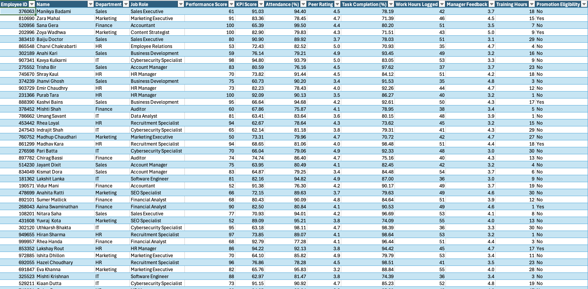

---

### Step 2 — Data Cleaning: Duplicate Check
> Ran Excel's built-in duplicate detection across all columns. Result: **No duplicate values found** — confirming a clean, reliable dataset ready for analysis.

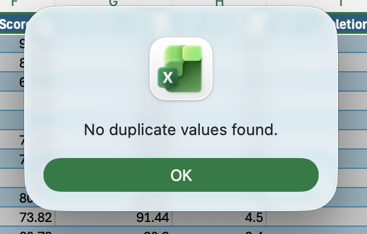

---

### Step 3 — Pivot Table Analysis

#### 3.1 Average Performance Score by Department
> Created a pivot table to calculate the average performance score per department, paired with a clustered column chart. HR leads with **76**, while Marketing and Sales average **74**.

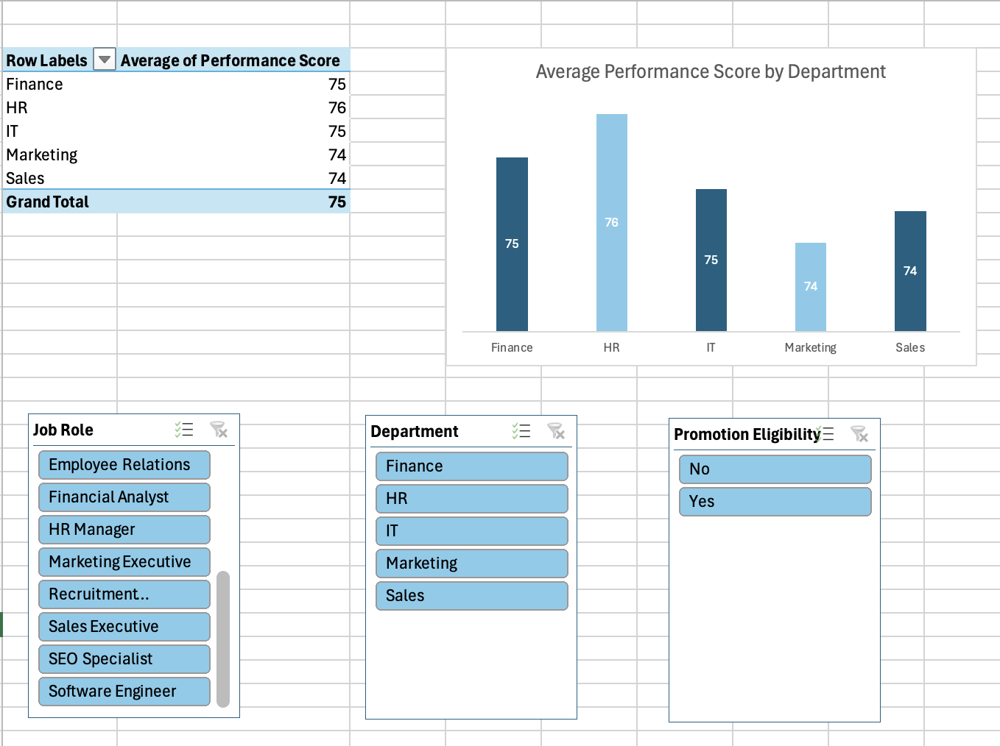

---

#### 3.2 Promotion Eligible Employees by Department
> Analyzed promotion eligibility counts across all departments. Out of 5,000 total employees, **695 are promotion-eligible**. HR has the highest eligible count (154), while IT has the lowest (129).

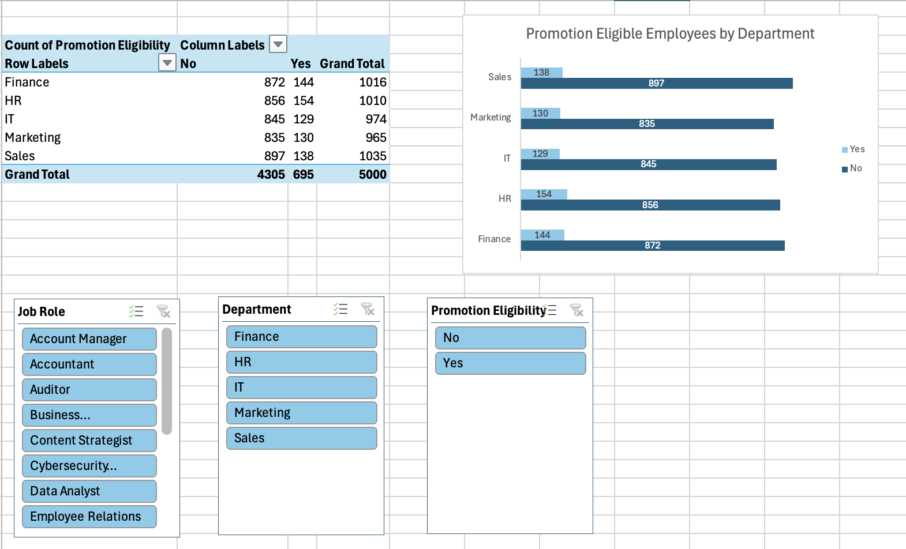

---

#### 3.3 Average KPI Score by Job Role
> Ranked all job roles by average KPI score. **Recruitment Specialists** lead at **78.11**, while **Marketing Executives** rank lowest at **76.50**. Overall average KPI: **77.38**.

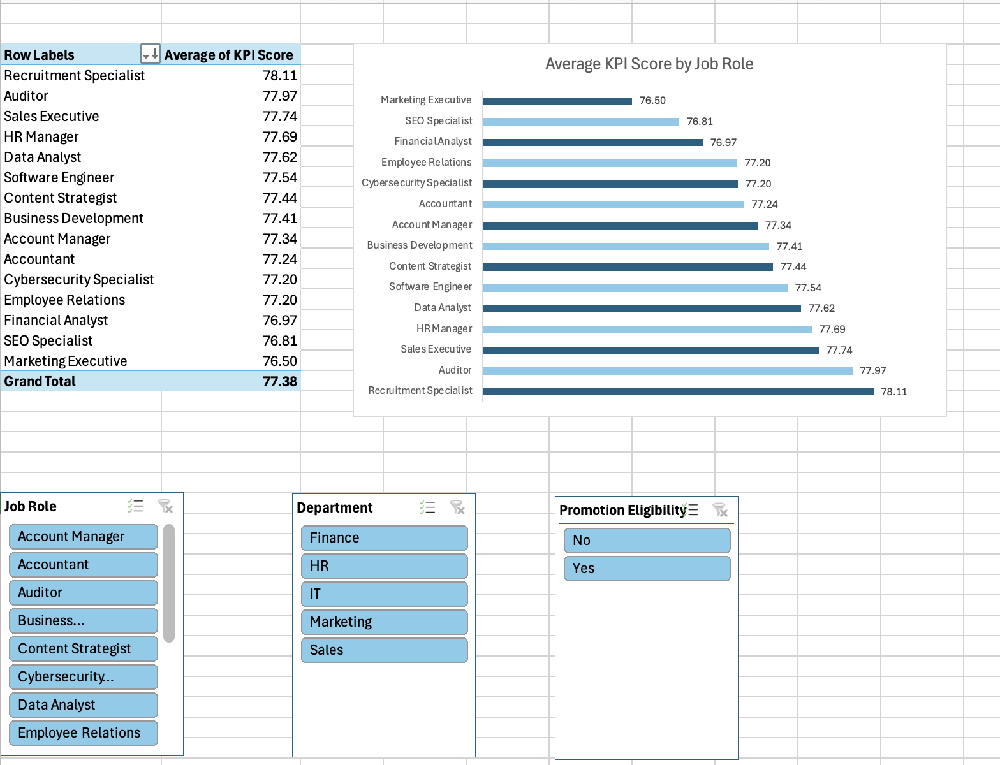

---

#### 3.4 Average Attendance by Department
> Analyzed attendance trends across departments using a line chart. **IT** has the highest attendance at **87.66%**, and **Marketing** the lowest at **87.26%**. Overall average: **87.47%**.

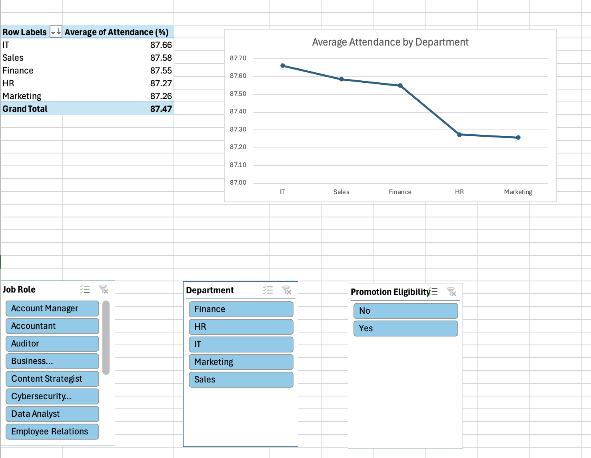

---

### Step 4 — Advanced Formulas

#### 4.1 VLOOKUP & INDEX-MATCH
> Added a `Bonus` column using **VLOOKUP** to map department-based bonuses from a lookup table. Used **INDEX-MATCH** to retrieve employee names by ID for cross-referencing.

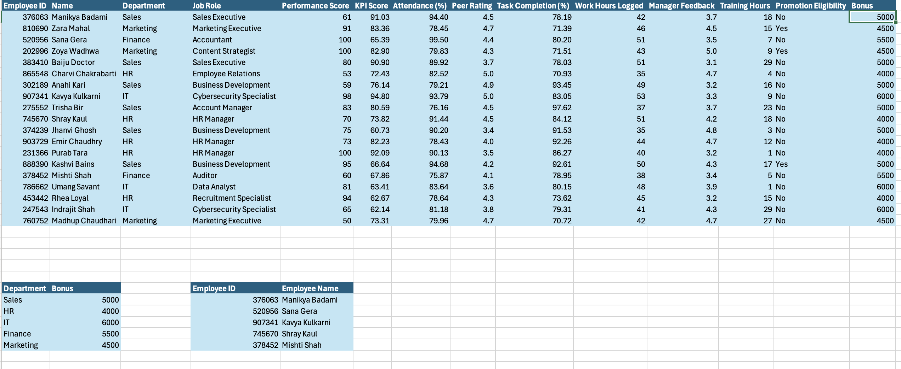

| Department | Bonus |
|---|---|
| Sales | ₹5,000 |
| HR | ₹4,000 |
| IT | ₹6,000 |
| Finance | ₹5,500 |
| Marketing | ₹4,500 |

---

#### 4.2 IF & Nested IF — Workload & Ratings
> Applied **IF** formulas to classify employees into `Workload Category` (Normal / High Workload) and **Nested IF** to derive `Ratings` (Poor / Average / Good / Excellent) based on performance score thresholds.

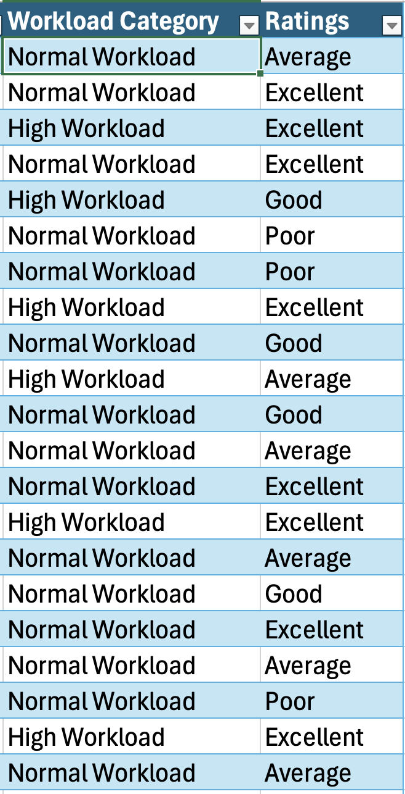

---

### Step 5 — Conditional Formatting
> Applied data bars on the `Attendance (%)` column for quick visual scanning, and color-coded arrow icons on `Peer Rating` — green arrows (↑) for high ratings, orange arrows (→) for average, and red arrows (↓) for low ratings.

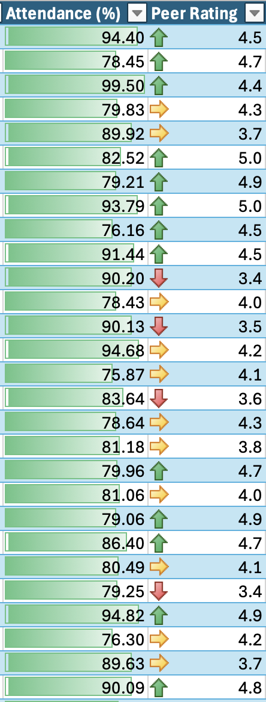

---

## 📈 Dashboard

> An interactive, single-page **Employee Performance Dashboard** consolidating all key insights with dynamic slicers for **Job Role**, **Department**, and **Promotion Eligibility**.

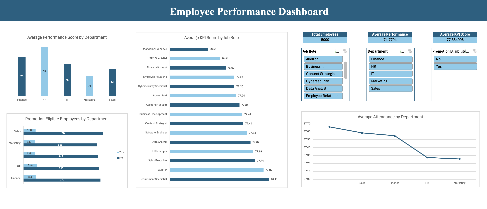

### Dashboard KPIs at a Glance

| Metric | Value |
|---|---|
| 👥 Total Employees | 5,000 |
| 📊 Avg Performance Score | 74.78 |
| 🎯 Avg KPI Score | 77.38 |
| 🗓️ Avg Attendance | 87.47% |
| ✅ Promotion Eligible | 695 |

---

## 📋 Documentation

> A dedicated Documentation sheet summarizes the entire project scope, tools used, and outputs generated for easy reference and handoff.

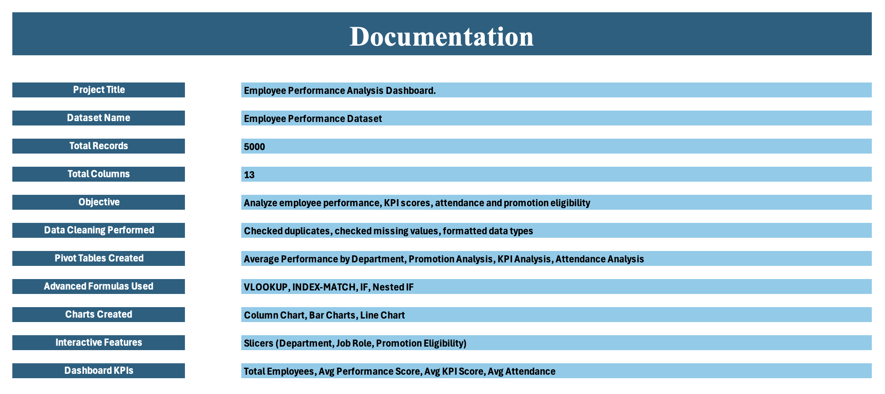

---

## 🛠️ Tools & Techniques Used

| Category | Details |
|---|---|
| **Platform** | Microsoft Excel |
| **Data Cleaning** | Duplicate check, missing value check, data type formatting |
| **Pivot Tables** | Average Performance, Promotion Analysis, KPI Analysis, Attendance Analysis |
| **Formulas** | VLOOKUP, INDEX-MATCH, IF, Nested IF |
| **Charts** | Column Chart, Horizontal Bar Charts, Line Chart |
| **Conditional Formatting** | Data Bars, Icon Sets (colored arrows) |
| **Interactive Features** | Slicers (Department, Job Role, Promotion Eligibility) |

---

## 💡 Key Insights

- 🏆 **HR** department leads in average performance score (**76**).
- 📌 **695 out of 5,000** employees are eligible for promotion (**13.9%**).
- 🎯 **Recruitment Specialists** have the highest average KPI score (**78.11**).
- 📅 **IT** has the best attendance rate (**87.66%**) among all departments.
- 💰 **IT** employees receive the highest departmental bonus (**₹6,000**).
- 📉 Performance scores across all departments are tightly clustered (74–76), indicating a consistent workforce.

---

## 👤 Author

**Devan Patel**
